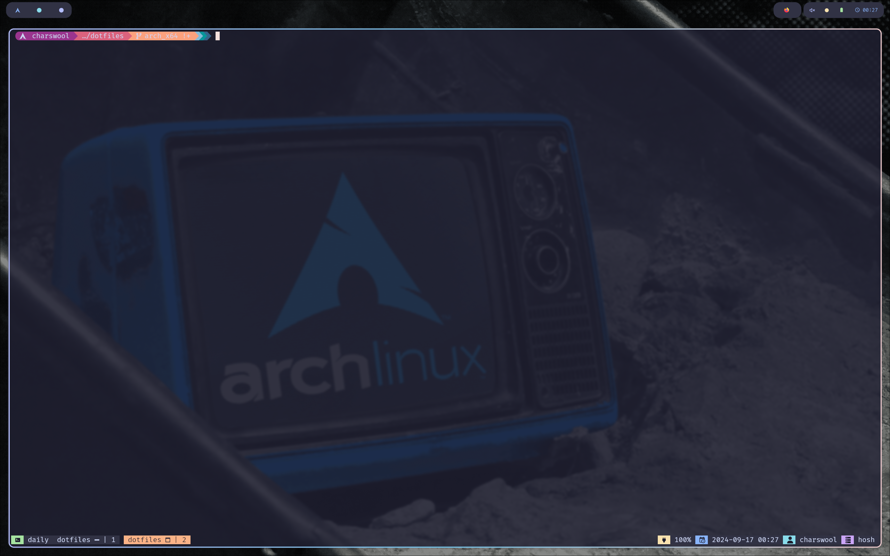

# dotfiles
My dotfiles which use [stow](https://www.gnu.org/software/stow/) to manage.

## Terminal



### [kitty](https://sw.kovidgoyal.net/kitty/)
* **font**: FiraCode Nerd Font
* **Color Theme**: [Catppuccin](https://github.com/catppuccin/kitty)
* Auto launch `tmux` on startup.

### [Starship](https://starship.rs/)
Use starship as the terminal prompt.


### zsh

#### Plugins
* zsh-autosuggestions
* zsh-syntax-highlighting

### neovim
#### Colorscheme
[Catppuccin](https://github.com/catppuccin/nvim)

#### keymaps

```lua

-- Hint: see `:h vim.map.set()`
-- Better window navigation
vim.keymap.set('n', '<C-h>', '<C-w>h', opts)
vim.keymap.set('n', '<C-j>', '<C-w>j', opts)
vim.keymap.set('n', '<C-k>', '<C-w>k', opts)
vim.keymap.set('n', '<C-l>', '<C-w>l', opts)

-- Resize with arrows
-- delta: 2 lines
vim.keymap.set('n', '<C-Up>', ':resize -2<CR>', opts)
vim.keymap.set('n', '<C-Down>', ':resize +2<CR>', opts)
vim.keymap.set('n', '<C-Left>', ':vertical resize -2<CR>', opts)
vim.keymap.set('n', '<C-Right>', ':vertical resize +2<CR>', opts)


-- plugin shortcuts
vim.keymap.set('n', '<leader>ff', ":Telescope find_files<CR>", opts)
vim.keymap.set('n', '<leader>fg', ":Telescope live_grep<CR>", opts)
vim.keymap.set('n', '<leader>fb', ":Telescope buffers<CR>", opts)
vim.keymap.set('n', '<leader>fh', ":Telescope help_tags<CR>", opts)
vim.keymap.set('n', '<leader>fq', ":Telescope quickfix<CR>", opts)

-----------------
-- Visual mode --
-----------------

-- Hint: start visual mode with the same area as the previous area and the same mode
vim.keymap.set('v', '<', '<gv', opts)
vim.keymap.set('v', '>', '>gv', opts)


-----------------
-- Insert mode --
-----------------

-- readline actions in nvim. <C-w> and <C-u> just behaves out-of-box.
vim.keymap.set('i', '<C-a>', '<C-o>^')
vim.keymap.set('i', '<C-e>', '<C-o>$')
vim.keymap.set('i', '<C-k>', '<C-o>C')

-----------------
-- LSP keymaps --
-----------------

-- Global mappings.
-- See `:help vim.diagnostic.*` for documentation on any of the below functions
vim.keymap.set('n', '<space>e', vim.diagnostic.open_float)
vim.keymap.set('n', '[d', vim.diagnostic.goto_prev)
vim.keymap.set('n', ']d', vim.diagnostic.goto_next)
vim.keymap.set('n', '<space>q', vim.diagnostic.setloclist)


-- Buffer local mappings.
-- See `:help vim.lsp.*` for documentation on any of the below functions
local opts = { buffer = ev.buf }
vim.keymap.set('n', 'gD', vim.lsp.buf.declaration, opts)
vim.keymap.set('n', 'gd', vim.lsp.buf.definition, opts)
vim.keymap.set('n', 'K', vim.lsp.buf.hover, opts)
vim.keymap.set('n', 'gi', vim.lsp.buf.implementation, opts)
vim.keymap.set('n', '<C-k>', vim.lsp.buf.signature_help, opts)
vim.keymap.set('n', '<space>wa', vim.lsp.buf.add_workspace_folder, opts)
vim.keymap.set('n', '<space>wr', vim.lsp.buf.remove_workspace_folder, opts)
vim.keymap.set('n', '<space>wl', function()
print(vim.inspect(vim.lsp.buf.list_workspace_folders()))
end, opts)
vim.keymap.set('n', '<space>D', vim.lsp.buf.type_definition, opts)
vim.keymap.set('n', '<space>rn', vim.lsp.buf.rename, opts)
vim.keymap.set({ 'n', 'v' }, '<space>ca', vim.lsp.buf.code_action, opts)
vim.keymap.set('n', 'gr', vim.lsp.buf.references, opts)
vim.keymap.set('n', '<space>f', function()
vim.lsp.buf.format { async = true }
end, opts)
```
For more keymaps(including lsp related), type `:map` in neovim.

#### Plugins
* neovim/nvim-lspconfig
* williamboman/mason.nvim
* nvim-lualine/lualine.nvim
* iamcco/markdown-preview.nvim
* nvim-treesitter/nvim-treesitter
* nvim-telescope/telescope.nvim
* windwp/nvim-autopairs
* numToStr/Comment.nvim
* rcarriga/nvim-notify
* kawre/leetcode.nvim
* ...

### tmux

#### Theme
[Catppuccin](https://github.com/catppuccin/tmux)

#### Keybinds
* **C^h,j,k,l** Move between different panels.
* **C^b + C^g** Invoke the navi.

#### Plugins
* tmux-plugins/tpm
* tmux-plugins/tmux-sensible
* tmux-plugins/tmux-battery

### yazi
Terminal builtin file manager.

## window

### hypr


### waybar

### zathura & foliate

### dunst

### rofi

## utils

### fzf

### lsd
Replacement of `ls`

### bat
Replacement of `cat`
